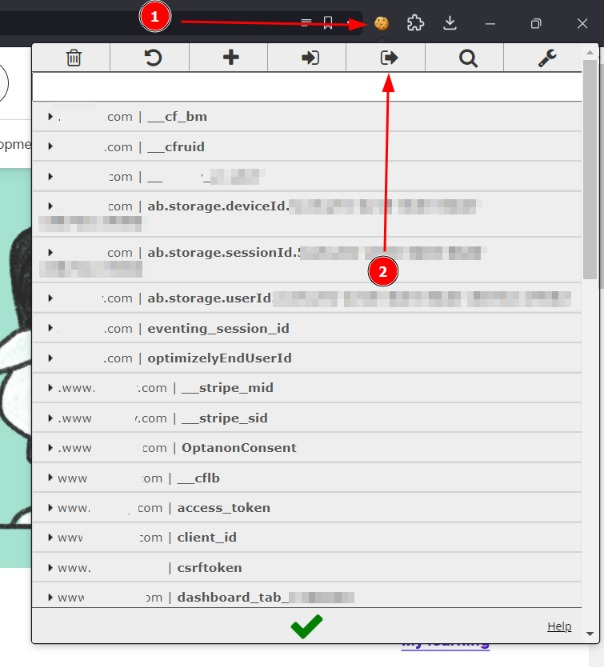

## Setting Up

This project only supports chromium based browsers, so you will need to install the browser along with a supported webdriver.

Easiest way to go about doing this without messing your current installs or whatever is to just simply download the standalone browser and the driver binaries:

Chromium Builds: [chromium.woolyss.com](https://chromium.woolyss.com)\
Webdriver Binaries: [googlechromelabs](https://googlechromelabs.github.io/chrome-for-testing/)

### Authentication

This script requires you to authenticate. This can be done either by using credentials (user and password) or by using cookies (recommended).

It is better to use cookies, since you might use the script multiple times and the servers set a limitation to the number of times you can login.

#### Getting Cookies

Extension Used: [EditThisCookie](https://www.editthiscookie.com)

You need to be using a chromium-based browser. Open it and visit the website and manually login. Once you have logged in, open the homepage and export it using EditThisCookie.



Doing so will copy the cookies to your clipboard. Open a new file and paste all the cookies there. Save (presumably in the same location as the script) it as a `.json` file in a text editor and note its location.


#### Setting up credentials

If you want to authenticate with your credentials instead, edit the `credentials.json` file and enter the credentials there like so:

```json
{
    "email": "youremail@mail.com",
    "password": "somepassword"
}
```

### Getting Headers

This script relies on headers to send XHR requests which needs proper headers which are user specific ie. Unique for a user.

In order to get the appropriate headers open the developer tools and swtich to the Network tab.

Once you are on the network tab open the My Learning page on the website that displays all the items you have bought or own.

As the page starts to load, the developer tools panel will start to get populated by the requests made. Switch to the Fetch/XHR Tab below the filter bar.

Select the entry that starts something along the lines of `/subscribed-courses/?ordering=-last_accessed...` as this is the particular request we are looking for.


The headers tab will automatically be selected by default and this contains the values we need.

A `headers.txt` file is already provided that acts like a template for you to compare and fill in the values.


### Changing Settings

All the configuration options are provided in `settings.json` which already contains the default values.

In case you did change any parameters or if some are not according to your setup you can change them (for eg. browser binary path or output directory)

### Installing pre-requisites

Assuming you are running this in a virtenv, you can simply install the requirements listed in `requirements.txt`

## Running the script

Running the script is as simple as:

```sh
$ python3 cli.py
```

No commandline arguments are needed since everything is configured in the settings file.